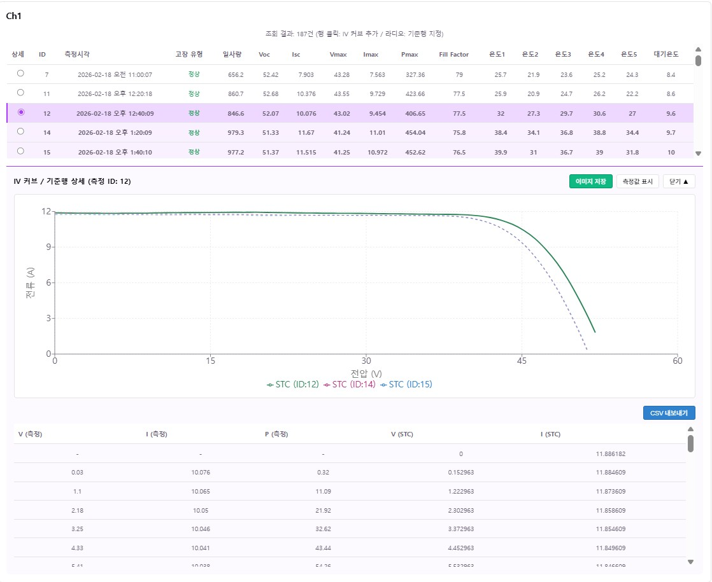
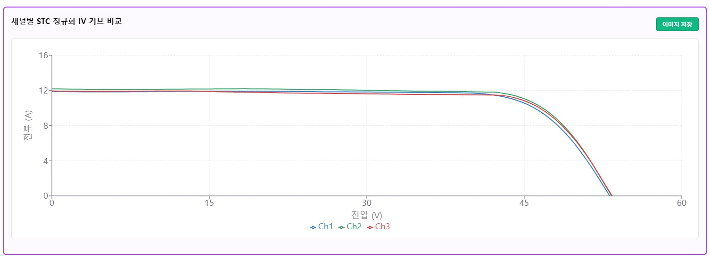
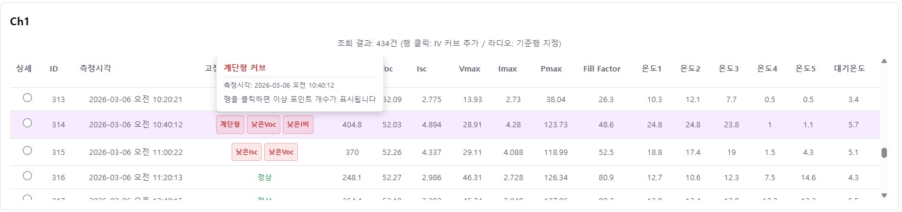

# 태양광 모듈 고장 분석 DB 구축 및 분석 툴 개발

## 1. 프로젝트 소개
본 프로젝트는 태양광 모듈에서 수집된 raw data를 기반으로 고장 분석에 활용할 수 있는 데이터베이스를 구축하고, 이를 조회·분석·시각화할 수 있는 오프라인 분석 툴을 개발하는 것을 목표로 한다.

주요 대상 데이터는 I-V 커브, 일사량, 모듈 온도 등이며, 엑셀 형태로 수집된 데이터를 파싱 및 전처리한 뒤 데이터베이스에 저장하고, STC 기준 정규화를 거쳐 사용자가 원하는 조건으로 조회 및 시각화할 수 있도록 구성한다.

본 프로젝트는 산학협력 과제를 기반으로 진행되며, 실시간 수집 시스템보다는 필요 시 데이터를 업로드하여 분석하는 형태의 로컬 기반 도구 개발에 초점을 둔다.

- **수요기관**: 한국전기안전공사 전기안전연구원

## 2. 주요 기능

### 구현 완료
- **다중 파일 업로드**: 엑셀 raw data 다중 업로드 및 채널별 일괄 파싱
- **데이터 조회 및 필터**: 채널(Ch1~Ch3) 공통 필터로 날짜·시간대·일사량 기준 동시 적용
- **I-V 커브 시각화**:
  - 채널별 IV 커브 (정규화 기본 표시 / 측정값 토글)
  - 종합 그래프 (기준행 일시 기준 채널 자동 매핑)
- **STC 정규화**: IEC 60891:2021 기반 표준 시험 조건(STC)으로 데이터 정규화
- **고장 유형 분석**: IEC 62446-1 기반 6종 고장 유형 자동 분류 및 상세 편차 정보 제공
  - 계단형 커브의 경우 이상 포인트를 그래프 위에 시각적으로 강조
- **CSV 내보내기**: 측정값과 정규화값을 함께 CSV로 저장 (Excel 호환)
- **오프라인 동작**: 인터넷 연결 없이 로컬 환경에서 실행 가능

### 화면 미리보기

**채널별 I-V 커브**



**종합 그래프 (다중 채널 일시 매핑)**



**고장 유형 배지 및 상세 편차 정보**



## 3. 다운로드 및 실행

### 일반 사용자
1. [Releases 페이지](https://github.com/Jeongwoohyeong/26-1Capstone/releases)에서 최신 `.zip` 파일 다운로드
2. 압축 해제 후 `Solar Analysis Tool.exe` 실행
3. 별도 설치 과정 없이 바로 사용 가능 (Windows 64-bit)

### 개발자
```bash
# 의존성 설치
npm install
cd BackEnd && pip install -r requirements.txt && cd ..

# 개발 서버 실행 (React + FastAPI 동시 기동)
StartServer.bat
# - React:  http://localhost:5173
# - Python: http://localhost:8000
```

## 4. 빌드 및 배포

빌드는 GitHub Actions가 태그 푸시(`v*.*.*`) 시점에 자동으로 처리한다.

```bash
git tag v1.0.0
git push origin v1.0.0
```

태그 푸시 → PyInstaller로 백엔드 빌드 → Electron zip 패키징 → Releases에 자동 첨부.

> 주의: 태그는 반드시 `main`에 머지된 커밋에만 붙여야 한다.

## 5. 기술 스택

- **UI**: React 19 + Vite + Recharts
- **DB**: SQLite
- **분석/API**: Python + FastAPI
- **패키징**: Electron + electron-builder (Windows zip)
- **CI/CD**: GitHub Actions (Windows runner)

## 6. 프로젝트 구조

```
26-1Capstone/
├── src/                  ← React 프론트엔드
│   ├── components/       ← FileUpload, DataTable
│   └── utils/            ← API 호출, CSV/차트 내보내기
├── BackEnd/              ← Python FastAPI 서버
│   ├── Main.py           ← API 엔트리포인트
│   ├── Parser.py         ← 엑셀 파싱
│   ├── Calculator.py     ← STC 정규화·고장 분석
│   └── DbAccess.py       ← DB 입출력
├── db/                   ← SQLite 스키마 및 초기화
├── electron/             ← Electron 메인·프리로드
└── .github/workflows/    ← 빌드/릴리스 워크플로우
```

## 7. 팀 역할 분담
본 프로젝트는 총 3명이 역할을 분담하여 진행한다.

- **UI**: [우형](https://github.com/Jeongwoohyeong)
- **DB**: [소윤](https://github.com/soyooon228)
- **분석**: [정우](https://github.com/shinchamchi0147)

각 팀원은 담당 영역을 중심으로 개발을 진행하되, 데이터 구조, 입출력 형식, 기능 연결 지점 등은 협업을 통해 조율한다.
